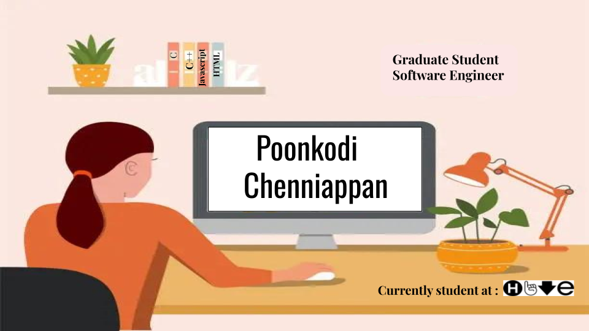

### Hi there 👋

### I'm Poonkodi Chenniappan!

* Currently : Student at Hive Helsinki.
* Previously : Software Engineer at Apere India Private Limited, Hyderabad.

### 🌱 Skills
* HTML
* CSS
* Javascript
* Typescript
* SQL
* C
* C++

### About Me ⚡:

Creative and dependable Entry level Web Developer Graduate with a Master of Computer Applications looking to leverage my skills to solve interesting problems that delight end-users. 
Knowledgeable with the principles and techniques of website construction. 
I am seeking a position with a growing organization where I learn and make a positive impact. I am eager to apply my academic and professional background towards launching a successful career as a Web Developer with an employer offering opportunities for professional development.		
I open to do freelansing also.

### What do I do for Fun?
- I love to read
- photography
- Explore nature outdoors.

#### Contact Info : 
 

#000000000000000000000000000

 
## 👋 Hi there! I’m a last year programming student at Hive Helsinki. 

## 👋 Hi there! I'm a last year programming student at Hive Helsinki. 

💻 Specialize in full-stack web development, bringing the harmony of nature to clean code.

🌱 Like a growing tree, I'm branching out into new technologies and frameworks.

🏔️ Determined to climb every coding challenge that comes my way.

### 🚀 Full Stack Projects
[**Full Stack**](https://github.com/full-stack-open-lk) | Modern JavaScript-based web development projects

### 🚀 Hive Helsinki Projects
[**Hive Projects**](https://github.com/hive-helsinki-projects) | C/C++ systems programming

## 🛠️ Technical skills

### Core Languages

### Web Development

### Databases & Tools

## 🌍 Connect with me

